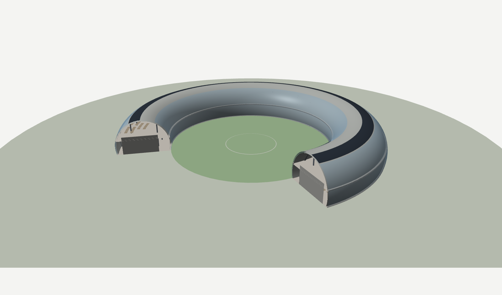
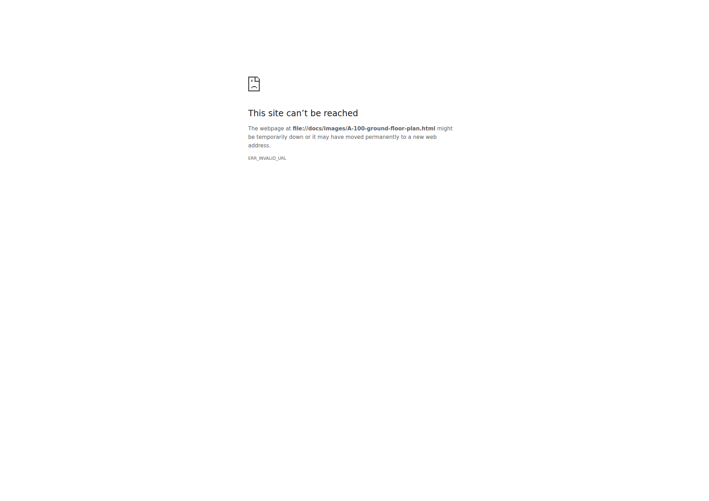
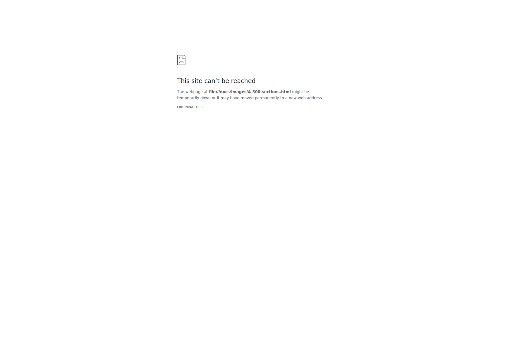
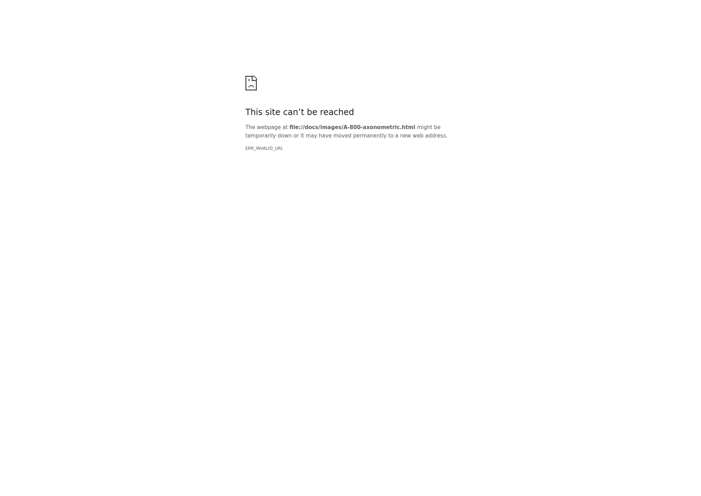

# TORUS — a two-storey office pavilion

A complete architectural project for an office building shaped as a torus:
a full set of drawings, a 3D model, and the parametric source that generates
both.

```
Overall diameter     75 000        Gross internal area   5 256 m²
Courtyard diameter   45 000        Workstations drawn      306
Height to apex        9 600        Developed envelope    5 244 m²
Floor plate depth    14 400        Storeys                   2
```

<p align="center">
  
</p>

---

## The idea in one paragraph

The building really is a torus, not a ring in plan: a circle of radius
**7 500** swept around a vertical axis at radius **30 000**, with its axis at
**+2 100** so that the ground plane truncates it exactly at the ground-floor
slab. The shell therefore springs straight out of the paving on two concentric
circles, leans outward to its widest at chest height, and returns to a crown
9.6 m up. Both floor plates are horizontal chords of that same circle, placed
symmetrically about its axis — which is why they come out identical: 14 400
deep annuli, glazed on both faces, with no desk more than 7.2 m from a window.

The full argument, including what the geometry costs and what is still open,
is in **[docs/design-report.md](docs/design-report.md)**.

## What is here

```
src/archiai/engine/   the shape-agnostic engine
  geom2d.py           rings, regions with holes, offsetting, line/region ops
  massing.py          the Massing protocol + Extrusion and Revolve typologies
  layout.py           daylight bands, circulation spine, cores, programme
  grid.py             orthogonal and radial setting-out grids
  draw.py             plans, elevations and sections for any typology
  brief.py            plain-language brief -> spec -> massing
  project.py          massing + brief -> floorplans -> sheets
  export.py           OBJ mesh and project manifest

src/archiai/service/  HTTP surface over the engine
  app.py              FastAPI: /v1/parse, /v1/generate, /v1/health
  storage.py          local disk or Supabase Storage, same interface
  generate.py         request -> project -> sheets, mesh, manifest

integration/          Arqio integration: SQL migration, TypeScript client
deploy/               Dockerfile and environment template
tests/                26 tests over the service and engine invariants

src/archiai/          the TORUS project — one source of truth
  params.py           every dimension in the project
  program.py          accommodation schedule as annular sectors
  svgkit.py           a small ISO-style drafting kit that writes SVG
  annot.py            dimensions, grid bubbles, tags, drawing symbols
  plans.py            floor plans, roof plan, site plan
  elevations.py       elevations and developed (unrolled) facades
  sections.py         sections through the axis of the torus
  details.py          typical bay section and 1:10 envelope details
  structure.py        framing plan and member schedule
  sheets.py           cover sheet, drawing register, area schedule
  axo.py              a painter's-algorithm renderer for the axonometrics
  model3d.py          Wavefront OBJ export
  scad.py             parametric OpenSCAD source
  viewer.py           self-contained WebGL viewer
  build.py            regenerates everything

output/drawings/      14 A1 sheets, SVG
output/model/         OBJ + MTL, OpenSCAD, WebGL viewer
docs/                 design report, technical specification, register
```

## Drawings

Fourteen ISO A1 sheets, drawn to ISO 128 line weights, listed in
**[docs/drawing-register.md](docs/drawing-register.md)**.

| | | | |
|---|---|---|---|
| A-000 Cover and register | A-010 Site plan 1:500 | A-100 Level 00 plan 1:150 | A-101 Level 01 plan 1:150 |
| A-102 Roof plan 1:150 | A-200 Elevations S/E 1:150 | A-201 Elevations N/W 1:150 | A-202 Developed elevations 1:200 |
| A-300 Sections A-A, B-B 1:150 | A-301 Typical bay 1:50 | A-500 Envelope details 1:10 | A-600 Framing plan 1:150 |
| A-700 Area schedule | A-800 Axonometric and assembly | | |

<p align="center">
  
  
  
</p>

Two drawings are worth singling out, because they are the ones a torus
actually needs:

- **A-300** — a plane through the axis of a torus cuts it in two *true
  circles*. The section is the cleanest statement of the whole building.
- **A-202** — the developed elevations. For a building with no flat facade,
  unrolling the skin is the only elevation that tells you where anything is.

## 3D model

| File | Use |
|---|---|
| `output/model/viewer.html` | Open in any browser. Orbit, cutaway slider, layer toggles, six view presets. Self-contained — no network, no libraries. |
| `output/model/torus-office.obj` | 25 182 faces in 17 named groups, metres. Opens in Blender, Rhino, SketchUp, MeshLab. |
| `output/model/torus-office.scad` | Parametric OpenSCAD. Change `R`, `r` or `zc` and re-render; a cutaway toggle is built in. |
| `output/web/index.html` | The whole project in one file: the live model, the geometry, and all 14 sheets with a zoomable viewer. |

The viewer, the mesh and the drawings are generated from the same geometry
functions, so they cannot drift apart.

## The engine

The torus above is one building. The engine generalises it: every drawing
only ever asks a building four questions, so any typology that answers them
gets plans, sections, elevations and a mesh for free.

```
plate(i)        floor plate at a level     ->  plans, areas, framing
cut(z)          solid material at height   ->  plan cut lines
build_mesh()    the envelope               ->  3D, renders
section() / silhouette()   generic, derived from the above
```

The same `cut(z)` call returns two curved annular bands for the torus and a
rectangular band for a drawn polygon, and no drawing code knows which.

One sentence produces a coordinated set of **45 sheets across six
disciplines** — architectural, structural, electrical, mechanical, public
health and fire — in under two seconds:

```sh
PYTHONPATH=src python3 -c "
from archiai.engine import brief, project
spec, massing, brf = brief.from_text(
    'a five-storey school around a courtyard, 9000 sqm, entrance from the west')
project.Project(massing, brf, {'number': 'DEMO'}).build('output/demo')"
```

| Family | Sheets |
|---|---|
| Architectural | cover and register, site plan, floor plans, roof plan, reflected ceiling plans, elevations, sections, area schedule, axonometric |
| Structural | foundation plan, framing plan per level |
| Electrical | small power and data, lighting and emergency lighting |
| Mechanical | ventilation per level |
| Public health | below-ground drainage |
| Fire | escape routes and travel distances per level |

Every quantity on those sheets is computed, not decorated: luminaires from
the lumen method, fresh air from occupancy, sprinkler heads from coverage
limits, column loads from tributary area, pad footings from bearing pressure,
travel distances checked against the escape limit.

Verified across footprints that share no code: courtyard blocks, L-plans,
slabs, towers with setbacks, hexagonal courts and rings all account for
95–97% of their floor plate, the remainder being wall thickness.

## The service

A stateless HTTP service wraps the engine so a platform can call it.
Generation is synchronous because it is fast — a five-storey school with
eight sheets, a mesh and a manifest takes about **400 ms**.

```sh
docker build -f deploy/Dockerfile -t archiai-engine .
docker run -p 8080:8080 --env-file deploy/env.example archiai-engine
```

| | |
|---|---|
| `GET /v1/health` | liveness, engine version, storage mode |
| `POST /v1/parse` | read a brief, return the spec **and every assumption made** |
| `POST /v1/generate` | generate, upload, return manifest and asset list |

`/v1/generate` takes exactly one of `brief`, `footprint` (a drawn outline in
metres) or `spec`. Files go to local disk or Supabase Storage behind one
interface. See [integration/README.md](integration/README.md) for the SQL
migration, the TypeScript client and the token-metering flow.

## Rebuilding

Pure Python 3, standard library only. No dependencies, no build step.

```sh
python3 -m archiai.build output          # the TORUS project
PYTHONPATH=src python3 -m pytest tests -q # 26 tests
PYTHONPATH=src python3 -m archiai.service # the HTTP service on :8080
```

```
TORUS  AAI-2601  rev P03
--------------------------------------------------------------
  A-000   Cover Sheet and Drawing Register           522 kB
  ...
  A-800   Axonometric and Assembly                   669 kB
--------------------------------------------------------------
  MESH    25182 faces, 30579 vertices               2311 kB
  SCAD    parametric source                            5 kB
  VIEWER  self-contained WebGL                        37 kB
--------------------------------------------------------------
  GIA 5 256 m²   |   306 workstations   |   14 sheets   |   0.6s
```

The whole document set takes about six tenths of a second to redraw. Change
`MAJOR_R` or `TUBE_Z` in `src/archiai/params.py` and every plan, section,
elevation, schedule, mesh and viewer updates consistently — including the
derived numbers written into the drawing notes.

## Reading the geometry

Two angles describe every point on the building:

- **θ** — plan angle, anticlockwise from east. North is 90°. Radial gridlines
  R01–R36 sit at 10° centres.
- **φ** — section angle within the tube. 0° is the outermost point of the
  tube, 90° the crown, 180° the courtyard-most point. The ground plane cuts
  the tube at φ = −16.26° and 196.26°; the Level 01 slab meets it at
  φ = 16.26° and 163.74°.

Everything on the drawings — envelope zones, the PV band, rooflights, the
headroom limit — is stated in those two angles.

## Licence

MIT for the code. The design is issued for coordination, not for construction.
